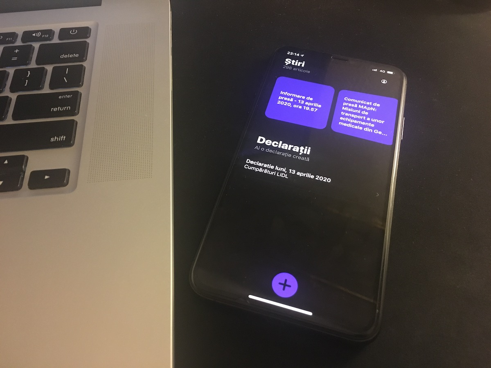

# Declarații

Acesta e un proiect personal care îmi permite să îmi generez declarații pe proprie răspundere instant, pentru a mă deplasa în perioada carantinei COVID-19. 

Am folosit acest prilej pentru a învăța SwiftUI. Codul nu este perfect, poate fi îmbunătățit, dar luând în considerare faptul ca l-am facut în timpul liber, eu zic că e ok 🧐.

## Instalare
Download and run în XCode 11.4

## Disclaimer
Folosești această aplicație pe proprie răspundere, la fel ca mine. Nu îmi asum nicio vină dacă primiți amendă în urma utilizării aplicației.

## Contribuții
Pull requests-urile sunt binevenite. Pentru schimbări majore, prima data deschideți vă rog un issue pentru a le discuta.

## Licență
Aveți voie să-l folosiți în interes personal, dar în niciun caz nu este permisă publicarea acestui proiect pe AppStore. 🙅🏻‍♂️
